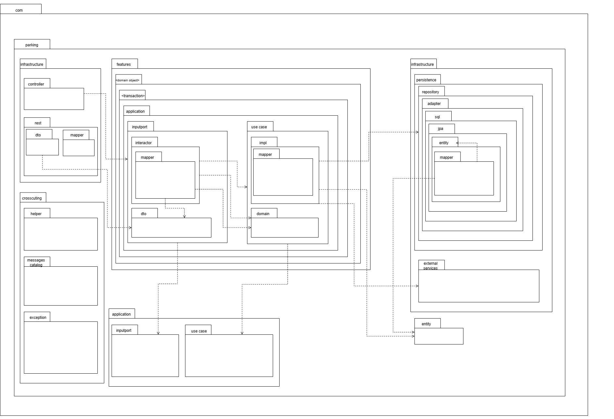
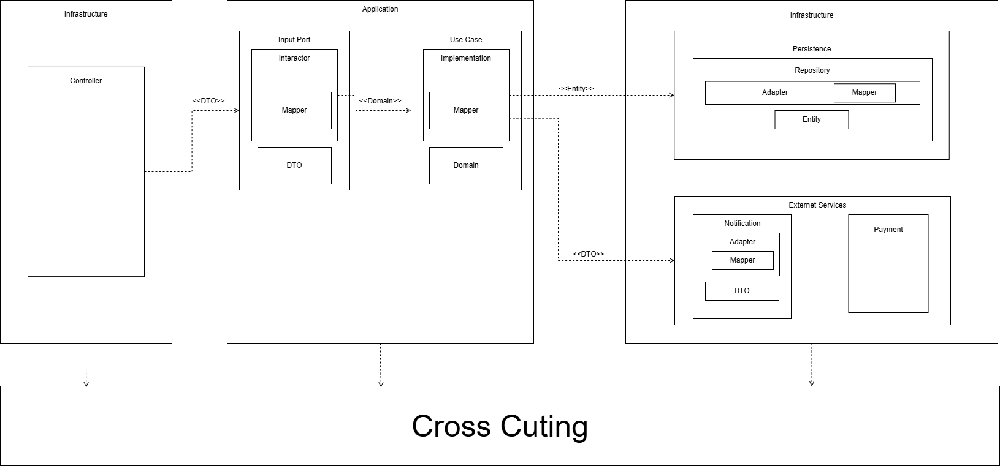
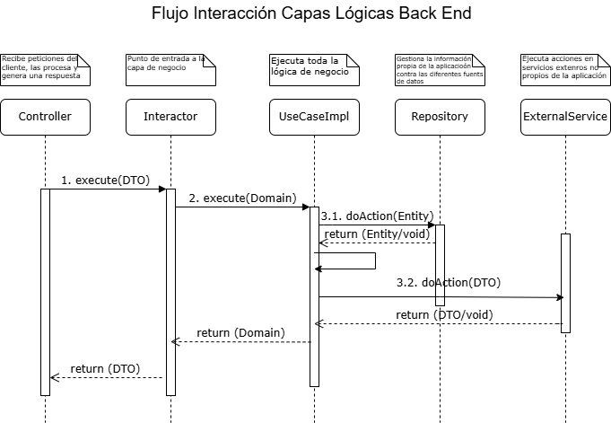
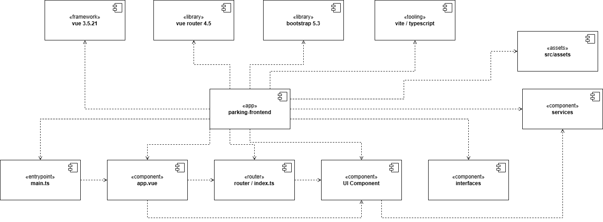
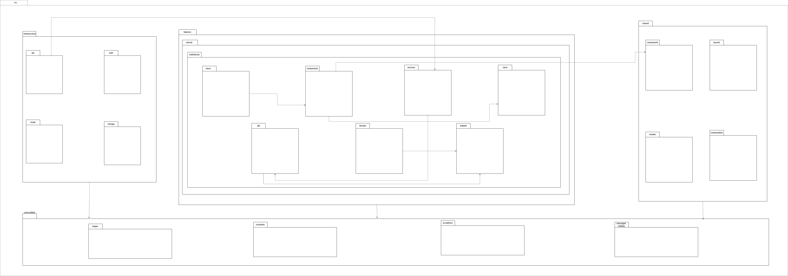
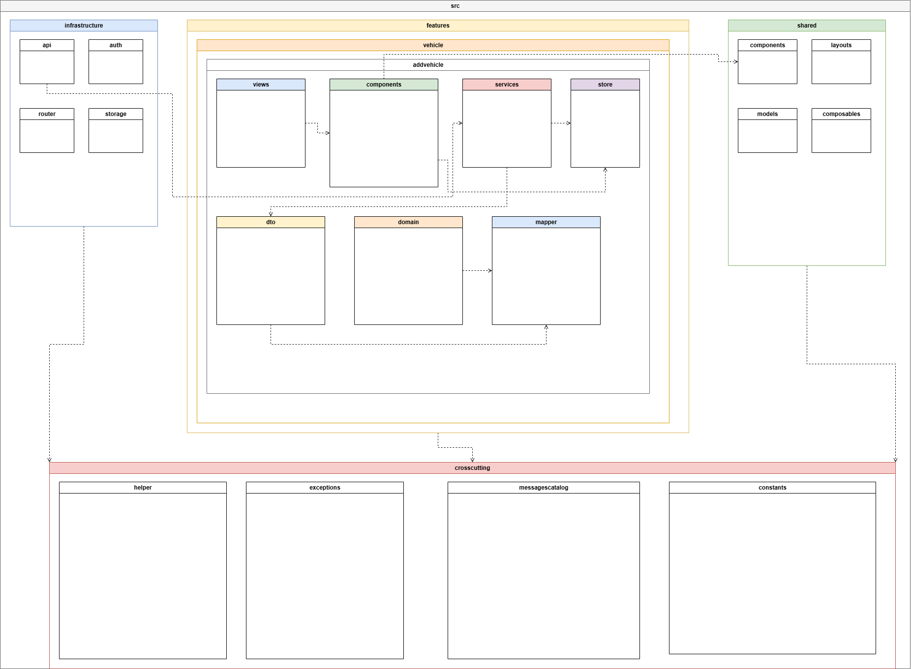
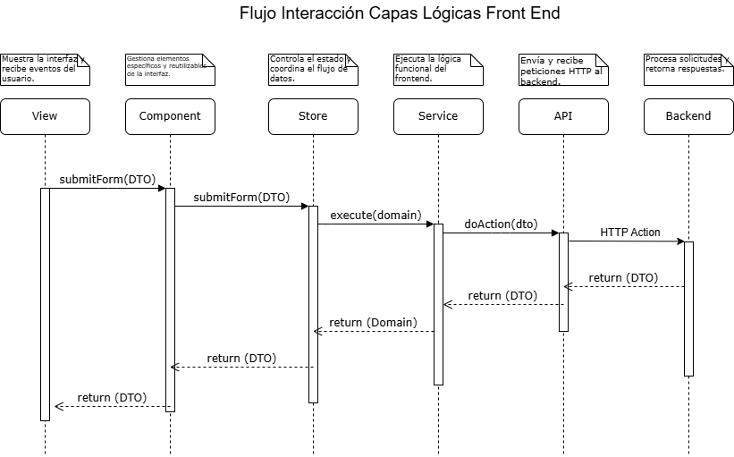

# ParKing - Sistema de Gestión de Parqueaderos

# Diagramas

## Diagrama de Componentes Backend

---

## Diagrama de Paquetes Backend

---

## Diagrama de Capas Lógicas Backend

---

## Diagrama de Secuencia Backend

El siguiente diagrama de secuencia muestra la interacción general de la arquitectura por capas anterior, con el fin de generar un entendimiento del flujo que se sigue por cada transacción que pueda involucrar o no retorno de datos.

---

## Diagrama de Componentes Frontend

---

## Diagrama de Paquetes Frontend

---

## Diagrama de Capas Lógicas Frontend

---

## Diagrama de Secuencia Frontend

El siguiente diagrama de secuencia muestra la interacción general de la arquitectura por capas del frontend, con el propósito de representar el flujo de comunicación entre los diferentes componentes de la aplicación, desde la interacción del usuario hasta el consumo de servicios del backend, permitiendo comprender cómo se procesan las solicitudes y respuestas durante cada transacción del sistema.

---

# Documentación

## Archivos Excel

- [Atributos de Calidad](docs/excel/Atributos-de-Calidad.xlsx)
- [Documentación Arquetipo y Arquitectura de Referencia](docs/excel/Documentación-Arquetipo-y-Arquitectura-de-Referencia.xlsx)
- [Escenarios de calidad](docs/excel/Escenarios-de-Calidad.xlsx)
- [Funcionalidades Críticas](docs/excel/Funcionalidades-Criticas.xlsx)
- [Mapa de Impacto](docs/excel/Mapa-de-Impacto.xlsx)
- [Matriz de Tiempos del Sistema](docs/excel/Matriz-de-Tiempos-del-Sistema.xlsx)
- [Restricciones de Negocio](docs/excel/Restricciones-de-Negocio.xlsx)
- [Restricciones Técnicas](docs/excel/Restricciones-Técnicas.xlsx)
- [Tácticas y Estrategias](docs/excel/Tácticas-Estrategias-Arquitectónicas-ParKing.xlsx)

# Autores

## Desarrolladores

* Jorge Alpidio Garcia Echeverri
* Juliana Naranjo Naranjo
